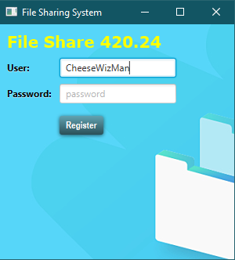

#  Assignment 2
## _File Sharing System_


#### Share Files with your Mates!


## Features

- Connects to a central server
- Upload your files to the server
- Download files from the server

A file sharing system that can be used to upload files into a shared folder
server that are connected to clients. The server is multi-threaded and
corresponds to a socket that remains open until it is handled. The client
has its own respective UI that where most of the file sharing takes place.
The server has a UI of a list of files in the shared folder of the server
while the bottom has a list of files in the shared folder of the local client.

## Improvements
A custom 'dark mode' CSS material design was implemented into the interface.

Interface was slightly modified as for a unique appearance. (Split from middle)

No limit to file size.

#### Login Screen Added



#### Display File Content (mainly txt, csv, json files)


## Steps to Clone Application

Configuration Settings


0. Git clone application.
1. Running the program in IntelliJ you must configure your JavaFX libraries.
2. Configure the application (set up your Server and Client).
3. Add them in compound, so the client can connect to the server.
4. Run the compound configuration.

### Command Line Option
OPTIONAL: If not running it in IntelliJ you can run these commands in a terminal

#### Running Server (from root: "Installed_Location"/2020_assignment_2/):
```sh
java src/sample/Server.java
```
#### Running Client (from root: "Installed_Location"/2020_assignment_2/):
```sh
java src/sample/Client.java
```

###### To Download:
```sh
java src/sample/Client.java <DOWNLOAD> <"FileName_To_Download"> <"Location_To_Download">
```

###### To Upload:
```sh
java src/sample/Client.java <UPLOAD> <"File_Location">
```

###### Check Contents of Server Shared Folder:
```sh
java src/sample/Client.java <DIR>
```

## Resources
[JavaFX Documentation]

[CSS Styling Documentation]

## License

_Jack Bowman 100752381_  
_Sanjay Deoram 100753118_  
_Romulo Parotirza 100753119_  
_Ontario Tech University_


[//]: # (These are reference links used in the body of this note and get stripped out when the markdown processor does its job. There is no need to format nicely because it shouldn't be seen. Thanks SO - http://stackoverflow.com/questions/4823468/store-comments-in-markdown-syntax)
[JavaFX Documentation]: <https://docs.oracle.com/javase/8/javafx/api/index.html>
[CSS Styling Documentation]: <https://docs.oracle.com/javafx/2/api/javafx/scene/doc-files/cssref.html>

